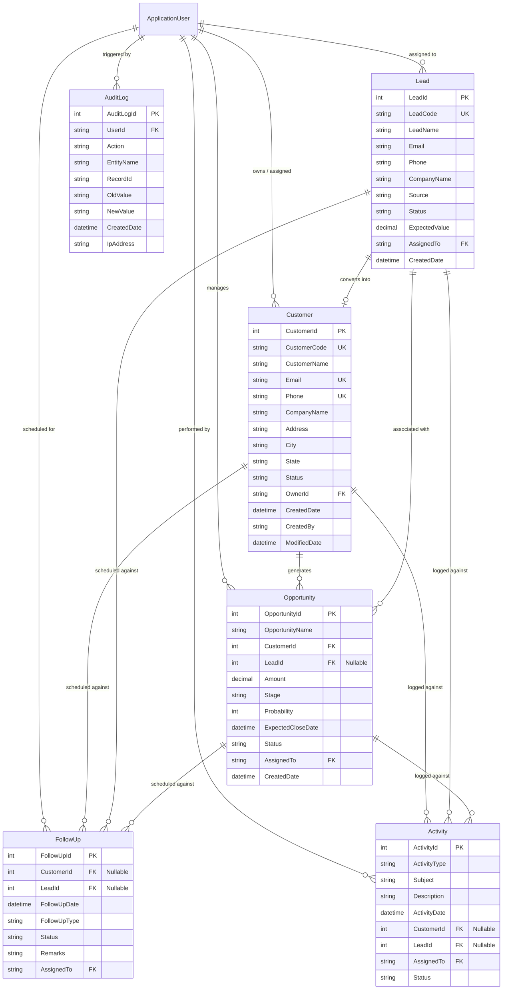
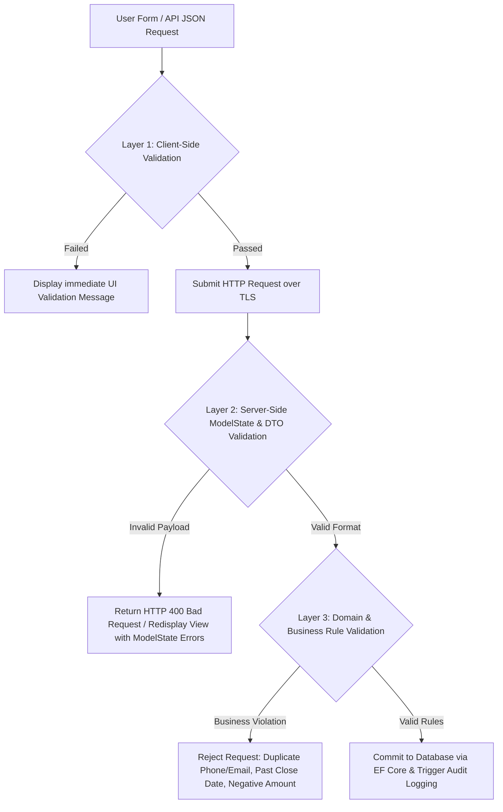
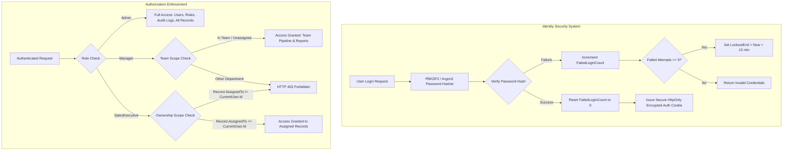
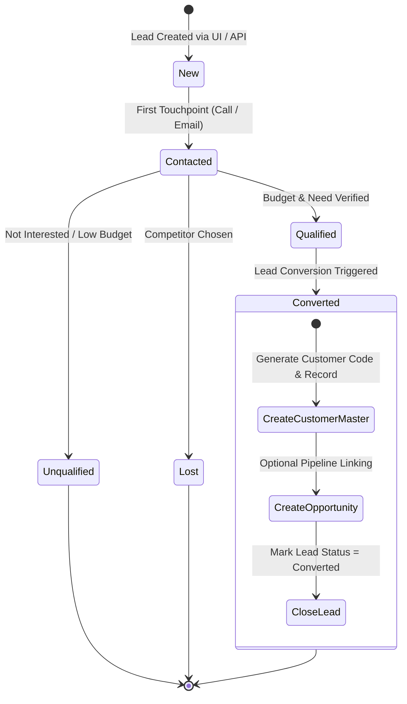
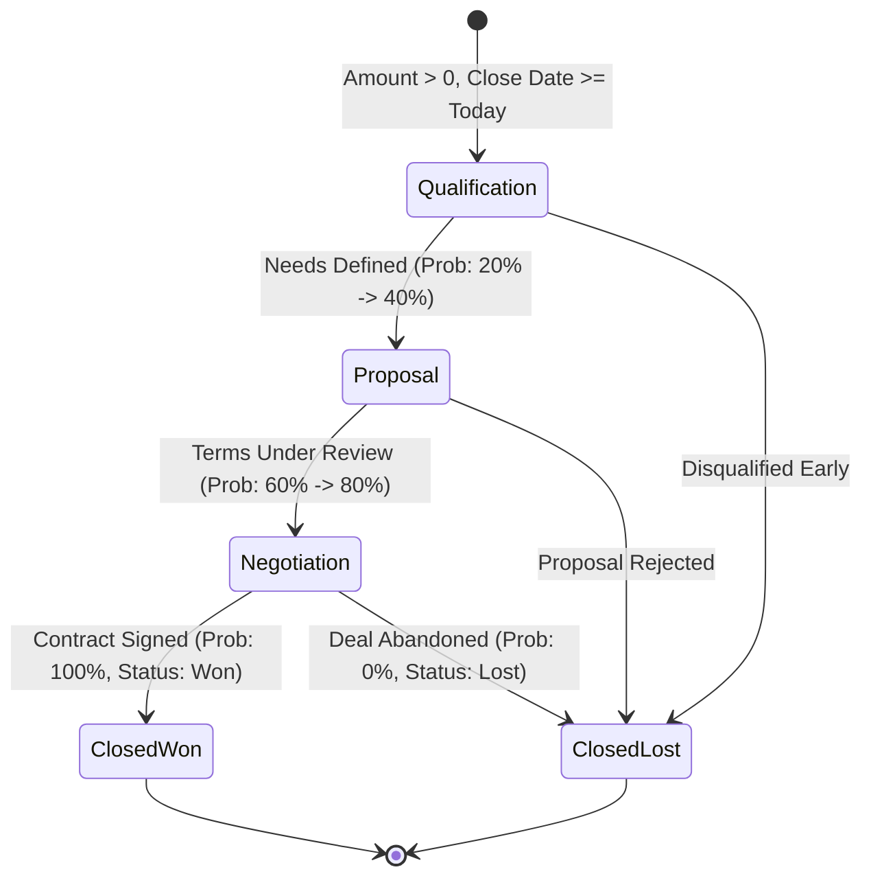
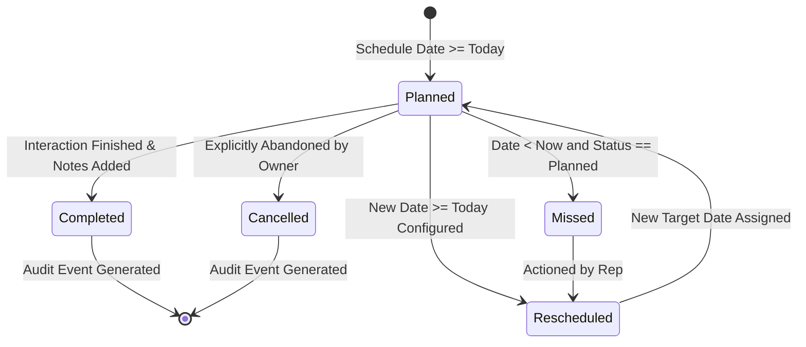
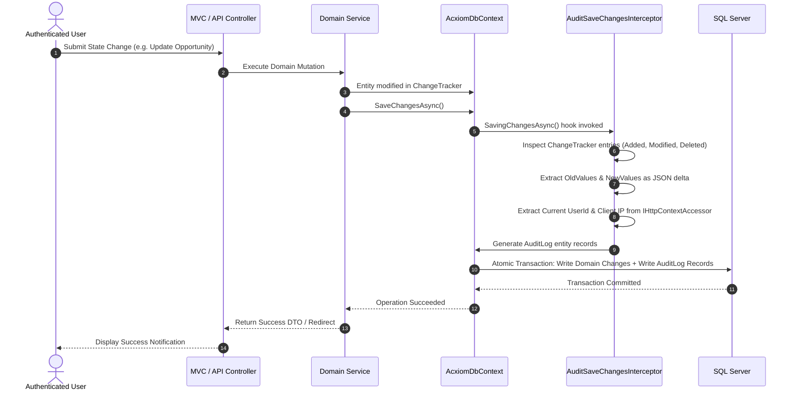
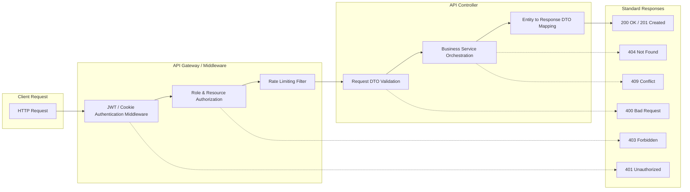

# AcxiomCRM — Phase-Wise Architecture & Technical Blueprint

> **Document Type:** System Architecture & Phase-Wise Implementation Roadmap  
> **Target System:** AcxiomCRM Enterprise Sales & Customer Relationship Management  
> **Technology Baseline:** ASP.NET Core (.NET 8/9), Entity Framework Core, SQL Server, ASP.NET Core Identity, Bootstrap 5, Chart.js  
> **Status:** Approved Architectural Specification  
> **Target Audience:** Engineering Leads, Software Architects, Full-Stack Developers, QA Engineers, Project Reviewers  

---

## 1. Executive Summary & Architectural Vision

The **AcxiomCRM** platform is an enterprise-grade customer relationship management solution engineered to support end-to-end sales lifecycle operations: prospective lead generation, qualification, customer onboarding, opportunity pipeline tracking, scheduled follow-ups, and sales analytics.

Unlike standard CRUD applications, AcxiomCRM enforces:
1. **Strict Multi-Tiered Validation:** Synchronized client-side UX checks, defensive server-side request validation, and authoritative domain business rule enforcement.
2. **Deterministic Role-Based Access Control (RBAC):** Hierarchical data-scoping across `Admin`, `Manager`, and `SalesExecutive` roles.
3. **Automated Immutable Audit Logging:** Change-data capture interceptors tracking security events and entity mutations with delta values, actor identity, and network origin.
4. **Decoupled API & Presentation Layers:** Dual-surface architecture supporting both responsive server-rendered Razor/Bootstrap interfaces and secured RESTful DTO APIs.

---

## 2. High-Level Layered System Architecture

The system implements a decoupled **Clean / N-Tier Layered Architecture** ensuring strict separation of concerns, testability, and technology independence.

```mermaid
graph TD
    subgraph Client Surface
        UI[Browser / Razor Views + Bootstrap 5]
        API_CLIENT[REST API Clients / External Consumers]
        CHART[Chart.js Visualization Engine]
    end

    subgraph Presentation & API Layer
        CTRL[MVC Controllers & Filters]
        API_CTRL[API Controllers /api/*]
        VMODELS[ViewModels & API DTOs]
        VAL_CLIENT[Client-side jQuery Unobtrusive Validation]
    end

    subgraph Application & Business Logic Layer
        AUTH_SVC[Identity & Authorization Services]
        LEAD_SVC[Lead & Conversion Workflow Service]
        OPP_SVC[Opportunity & Pipeline Engine]
        CUST_SVC[Customer Management Service]
        ACT_SVC[Follow-Up & Activity Service]
        REP_SVC[Analytics & Reporting Service]
        VAL_SVC[Server & Business Validation Engine]
    end

    subgraph Domain Layer
        ENTITIES[Domain Entities: Customer, Lead, Opportunity, FollowUp, Activity, User, Role]
        ENUMS[Enums: LeadStatus, OpportunityStage, ActivityType, FollowUpStatus]
        INTERFACES[Repository & Service Interfaces]
    end

    subgraph Data Access & Infrastructure Layer
        DBCONTEXT[AcxiomDbContext & EF Core]
        AUDIT_INTERCEPTOR[AuditSaveChangesInterceptor]
        IDENTITY_STORE[ASP.NET Core Identity Stores]
        REPOS[Repository Implementations & Unit of Work]
    end

    subgraph Persistence Layer
        SQL[(Microsoft SQL Server Database)]
    end

    subgraph Cross-Cutting Security & Diagnostics
        SEC[ASP.NET Identity + Cookie/JWT Auth + Antiforgery]
        AUDIT[Immutable Audit Log System]
        LOG[Structured Logging & Global Exception Handlers]
    end

    UI --> CTRL
    CHART --> UI
    API_CLIENT --> API_CTRL
    CTRL --> VMODELS
    API_CTRL --> VMODELS
    CTRL --> LEAD_SVC & OPP_SVC & CUST_SVC & ACT_SVC & REP_SVC
    API_CTRL --> LEAD_SVC & OPP_SVC & CUST_SVC & ACT_SVC & REP_SVC
    LEAD_SVC & OPP_SVC & CUST_SVC & ACT_SVC & REP_SVC --> INTERFACES
    INTERFACES --> DBCONTEXT
    DBCONTEXT --> REPOS
    DBCONTEXT --> AUDIT_INTERCEPTOR
    AUDIT_INTERCEPTOR --> DBCONTEXT
    DBCONTEXT --> SQL
    IDENTITY_STORE --> SQL

    SEC -.-> Presentation & API Layer
    AUDIT -.-> Application & Business Logic Layer
    LOG -.-> Data Access & Infrastructure Layer
```

### Architectural Layer Responsibilities

| Layer | Components | Responsibilities |
|---|---|---|
| **Presentation Layer** | Razor Views, Tag Helpers, ViewModels, Bootstrap 5, Chart.js, jQuery Validation | Renders responsive layouts, executes client-side form validation, binds user actions, and displays dashboard metrics. |
| **API Layer** | ASP.NET Core Web API Controllers, Data Transfer Objects (DTOs), API Filters | Exposes standard RESTful endpoints (`/api/customers`, `/api/leads`, etc.), executes request payload validation, returns standard HTTP status codes. |
| **Application / Service Layer** | Workflow Services, DTO Mappers, Business Rules Engine, Report Calculators | Orchestrates use cases, coordinates multi-entity operations (e.g. Lead-to-Customer conversion), and enforces business logic. |
| **Domain Layer** | POCO Entities, Domain Enums, Domain Exceptions, Repository Contracts | Contains core CRM business models and invariants, isolated from database and UI frameworks. |
| **Data Access Layer** | `AcxiomDbContext`, EF Core Migrations, Entity Configurations, Audit Interceptor | Manages database mappings, handles relational constraints and indexes, captures audit trail snapshots before commit. |
| **Security Layer** | ASP.NET Core Identity (`ApplicationUser`, `ApplicationRole`), Security Stamps, Password Hasher, Data Protection API | Manages user credentials, authentication cookies, claims-based role policies, lockout counters, and anti-forgery tokens. |

---

## 3. Domain Model & Relational Database Design

The database schema utilizes strict relational integrity, indexed foreign keys, normalized master tables, and an immutable audit log.



---

## 4. Multi-Layer Validation Framework

AcxiomCRM implements a three-tier validation architecture. Bypassing client-side controls does not compromise database integrity.



### Validation Matrix & Rules Catalog

| Field / Feature | Client-Side Rule (UI / UX) | Server-Side Rule (Controller / DTO) | Domain & Business Validation (Service Layer) | Error Feedback Message |
|---|---|---|---|---|
| **Customer Name** | `[Required]`, `MaxLength(100)` | DataAnnotation / FluentValidation | Must not be empty after trimming | `"Customer Name is required and cannot exceed 100 characters."` |
| **Customer Email** | `[Required]`, `[EmailAddress]` format | Regex validation for RFC-compliant email | **Uniqueness Check:** Must not exist in active Customer records | `"Enter a valid email address."` / `"A customer with this email already exists."` |
| **Customer Phone** | `[Required]`, 10-digit format check | Regex: `^[6-9]\d{9}$` or localized E.164 | **Uniqueness Check:** Must not exist in active Customer records | `"Enter a valid 10-digit mobile number."` / `"Phone number already registered."` |
| **Lead Status** | Dropdown selection | Required, Enum parsing check | Valid lifecycle transition only (e.g., cannot convert from Lost) | `"Invalid Lead Status provided."` |
| **Opportunity Amount** | Numeric, client regex > 0 | `Range(0.01, 999999999.99)` | Must be strictly > 0 for all active opportunities | `"Opportunity Amount must be greater than 0."` |
| **Opportunity Probability**| Numeric, slider/input 0 to 100 | `Range(0, 100)` | Integer bound between 0 and 100 inclusive | `"Probability must be between 0 and 100."` |
| **Expected Close Date** | HTML5 `min="today"` datepicker | `[DataType(DataType.Date)]` | Must be $\ge$ Current Date ($T \ge \text{Today}$) for active opportunities | `"Expected Close Date cannot be in the past."` |
| **Follow-Up Date** | HTML5 `min="today"` datetime-local | Required date/time | Must be $\ge$ Current Date/Time for newly planned follow-ups | `"Follow-up date cannot be earlier than today."` |
| **Duplicate Customer** | Keyup/blur duplicate lookup | Database query validation | Combined duplicate detection (Name + Email or Name + Phone) | `"A customer with matching identifying credentials already exists."` |

---

## 5. Security, Identity & Role-Based Authorization Engine

Security is anchored on **ASP.NET Core Identity** utilizing industry-standard cryptographic primitives without bespoke password tables.



### Role Authorization & Data Scope Matrix

| Module / Action | Admin | Manager | Sales Executive | Enforcement Mechanism |
|---|---|---|---|---|
| **User Administration** | Full CRUD, Lock/Unlock, Password Reset | View Only (Assigned Team) | No Access | `[Authorize(Roles = "Admin")]` |
| **Role Management** | Full CRUD | No Access | No Access | `[Authorize(Roles = "Admin")]` |
| **Audit Log Viewing** | Full search & filter across all logs | Department/Team Audit Logs | No Access | `[Authorize(Roles = "Admin,Manager")]` |
| **Customer Management**| View All, Create, Edit All, Delete | View Team/All, Create, Edit Team | View & Edit Assigned Only | `IQueryable` Scoping Filter (`Where(c => c.OwnerId == userId)`) |
| **Lead Conversion** | Any Lead | Team Leads | Assigned Leads | Domain Service Scope Check |
| **Opportunity Pipeline**| Global pipeline & forecasts | Team pipeline & forecasts | Own assigned opportunities | Query Scoped + Controller Authorization |
| **Executive Dashboard** | Company-wide KPIs & Security Stats | Team KPIs, Pipeline & Conversions | Individual Targets, Overdue Follow-ups | ViewModel populated based on User Claim Scope |
| **REST API Access** | Global access to endpoints | Scoped access via Token/Cookie | Scoped access via Token/Cookie | Policy-based endpoint filters |

---

## 6. Core Business Workflows & State Machines

### 6.1 Lead-to-Customer & Opportunity Conversion State Machine



### 6.2 Opportunity Lifecycle & Weighted Pipeline Calculation



$$\text{Weighted Pipeline Value} = \sum_{i=1}^{n} \left( \text{Amount}_i \times \frac{\text{Probability}_i}{100} \right) \quad \forall \, \text{Opportunity}_i \text{ where } \text{Stage} \notin \{\text{ClosedLost}\}$$

### 6.3 Follow-Up Scheduling & Action State Machine



---

## 7. Automated Audit Logging Engine

Audit logging is enforced automatically at the data persistence boundary via an **EF Core `SaveChangesInterceptor`**, preventing developers from inadvertently bypassing audit records.



### Audit Log Schema Structure

```csharp
public class AuditLog
{
    public int AuditLogId { get; set; }
    public string? UserId { get; set; }
    public string Action { get; set; } = string.Empty;       // "LOGIN", "CREATE", "UPDATE", "DELETE", "LOCKOUT"
    public string EntityName { get; set; } = string.Empty;   // "Customer", "Lead", "Opportunity", "FollowUp"
    public string RecordId { get; set; } = string.Empty;     // Primary key string representation
    public string? OldValue { get; set; }                    // JSON serialized prior state
    public string? NewValue { get; set; }                    // JSON serialized updated state
    public DateTime CreatedDate { get; set; } = DateTime.UtcNow;
    public string? IpAddress { get; set; }
}
```

---

## 8. REST API Architecture & DTO Contracts

The REST API surfaces standard HTTP endpoints with strict payload validation, DTO transformation, and proper status codes.



### REST API Endpoint Registry

| Verb | Endpoint | Description | Request DTO | Response DTO / Codes |
|---|---|---|---|---|
| `POST` | `/api/auth/login` | Authenticates credentials and returns session/token | `LoginRequestDto` | `AuthResponseDto` (200, 400, 401, 429) |
| `POST` | `/api/auth/logout` | Terminates active session | Empty | `200 OK` |
| `GET` | `/api/customers` | Searches & paginates customers in scope | Query Parameters | `PagedResult<CustomerDto>` (200) |
| `GET` | `/api/customers/{id}`| Retrieves single customer detail | None | `CustomerDetailDto` (200, 404) |
| `POST` | `/api/customers` | Creates customer with uniqueness validation | `CreateCustomerDto` | `CustomerDto` (201 Created, 400, 409) |
| `PUT` | `/api/customers/{id}`| Updates existing customer record | `UpdateCustomerDto` | `CustomerDto` (200 OK, 400, 404, 409) |
| `DELETE`| `/api/customers/{id}`| Soft-deletes or deactivates customer | None | `204 No Content` (403, 404) |
| `GET` | `/api/leads` | Lists leads filtered by role scope | Query Parameters | `PagedResult<LeadDto>` (200) |
| `POST` | `/api/leads` | Creates new prospective lead | `CreateLeadDto` | `LeadDto` (201 Created, 400) |
| `GET` | `/api/opportunities`| Retrieves pipeline opportunities | Query Parameters | `PagedResult<OpportunityDto>` (200) |
| `POST` | `/api/opportunities`| Creates sales opportunity | `CreateOpportunityDto`| `OpportunityDto` (201, 400) |
| `GET` | `/api/followups` | Lists upcoming and pending follow-ups | Query Parameters | `List<FollowUpDto>` (200) |
| `POST` | `/api/followups` | Schedules a new follow-up | `CreateFollowUpDto` | `FollowUpDto` (201, 400) |
| `GET` | `/api/reports/pipeline`| Aggregated pipeline report data | Filter Parameters | `PipelineReportDto` (200, 403) |

---

## 9. Comprehensive Phase-Wise Implementation Roadmap

The execution is structured into **9 distinct, sequential phases**. Each phase contains clear objectives, concrete deliverables, architecture milestones, and exit gate criteria.

```mermaid
gantt
    title AcxiomCRM Phase-Wise Implementation Schedule
    dateFormat  YYYY-MM-DD
    section Foundation
    Phase 0: Architecture Skeleton & Solution Init :p0, 2026-10-01, 3d
    Phase 1: Identity, RBAC & Core Data Context    :p1, after p0, 4d
    section Core Workflows
    Phase 2: Customer & Lead Management Engine     :p2, after p1, 5d
    Phase 3: Opportunity, Pipeline & Follow-Ups    :p3, after p2, 5d
    section Cross-Cutting
    Phase 4: Audit Logging & Interceptors          :p4, after p3, 3d
    Phase 5: Secure REST API & DTO Subsystem       :p5, after p4, 4d
    section Analytics & UI
    Phase 6: Executive Dashboard & Chart.js        :p6, after p5, 4d
    Phase 7: Comprehensive Reporting Engine        :p7, after p6, 3d
    section Hardening
    Phase 8: Security Verification & Final QA      :p8, after p7, 4d
```

---

### Phase 0: Project Inception, Repository & Solution Architecture Skeleton

#### Objective
Establish an enterprise-grade ASP.NET Core solution skeleton adhering to Clean Architecture principles, automated linting, configuration management, and database scaffolding.

#### Key Architectural Activities & Deliverables
1. **Solution Structure Setup:**
   ```text
   AcxiomCRM.sln
   ├── src/
   │   ├── AcxiomCRM.Core/             (Domain Entities, Enums, Interfaces)
   │   ├── AcxiomCRM.Application/      (Services, DTOs, Validators, ViewModels)
   │   ├── AcxiomCRM.Infrastructure/   (DbContext, EF Migrations, Repositories, Audit)
   │   └── AcxiomCRM.Web/              (Controllers, Views, API Controllers, Static Assets)
   └── tests/
       ├── AcxiomCRM.UnitTests/
       └── AcxiomCRM.IntegrationTests/
   ```
2. **Configuration & Dependency Baseline:**
   - Configure `appsettings.json` and `appsettings.Development.json` with SQL Server connection strings and Identity configuration tokens.
   - Configure dependency injection container in `Program.cs`.
3. **Static Assets & Layout Foundation:**
   - Integrate Bootstrap 5, FontAwesome / Bootstrap Icons, jQuery, and jQuery Validation Unobtrusive.
   - Create responsive `_Layout.cshtml` containing navigation bar, role-based menu placeholders, user profile badge, and notification toast container.

#### Exit Gate Criteria
- [x] Solution compiles with zero errors and warnings.
- [x] Local SQL Server connection establishes successfully via EF Core CLI (`dotnet ef`).
- [x] Master responsive layout renders with responsive mobile navbar.

---

### Phase 1: Authentication, Authorization & Identity Management Engine

#### Objective
Implement an impenetrable authentication and authorization infrastructure using ASP.NET Core Identity with role-based policies, password complexity rules, brute-force lockout counters, and seed data.

#### Key Architectural Activities & Deliverables
1. **Identity Schema & DbContext Setup:**
   - Extend `IdentityUser` to `ApplicationUser` (`FullName`, `CreatedDate`, `IsActive`, `Department`).
   - Extend `IdentityRole` to `ApplicationRole`.
   - Setup `AcxiomDbContext : IdentityDbContext<ApplicationUser, ApplicationRole, string>`.
2. **Password Policy & Lockout Configuration:**
   - Require minimum 8 characters, at least 1 digit, 1 uppercase, 1 lowercase, 1 non-alphanumeric character.
   - Set `MaxFailedAccessAttempts = 5`, `DefaultLockoutTimeSpan = TimeSpan.FromMinutes(15)`.
3. **Role & Initial Admin Seeder:**
   - Automated seeder creating roles: `Admin`, `Manager`, `SalesExecutive`.
   - Provision default administrator account (`admin@acxiomcrm.local`) securely with uncompromised temporary credentials.
4. **Account Controller & Razor Views:**
   - Implement `Login`, `Register` (Admin-invoked or self-service if permitted), and `Logout` actions.
   - Enforce `[ValidateAntiForgeryToken]` across all POST endpoints.
   - Protect sensitive cookies with `HttpOnly`, `SameSite = SameSiteMode.Lax`, and `SecurePolicy = CookieSecurePolicy.Always`.

#### Exit Gate Criteria
- [x] Unauthenticated users trying to access `/Dashboard` or `/Customer` are redirected to `/Account/Login`.
- [x] 5 consecutive invalid login attempts successfully lock out the target account for 15 minutes.
- [x] Plaintext passwords never touch database persistence.

---

### Phase 2: Customer & Lead Management Engine

#### Objective
Construct the core customer repository and prospective lead tracking engine with end-to-end multi-layer validation, duplicate prevention, and seamless lead conversion.

#### Key Architectural Activities & Deliverables
1. **Entity Definition & EF Mappings:**
   - Define `Customer` and `Lead` entities with strict database constraints, unique indexes on `Email` and `Phone`.
   - Implement soft-delete flag (`IsDeleted`) to preserve historical integrity.
2. **Validation Subsystem:**
   - Implement Client-Side jQuery validation rules for mandatory fields, phone numbers (10 digits), and email syntax.
   - Implement Server-Side `ModelState` checks and Service-Layer unique verification queries.
3. **Lead Management Features:**
   - CRUD controllers for Leads with status indicators (`New`, `Contacted`, `Qualified`, `Unqualified`, `Lost`).
   - Lead assignment dropdown filtered by active `SalesExecutive` users.
4. **Lead-to-Customer Conversion Workflow:**
   - Implement atomic transactional conversion service:
     - Verify Lead status is `Qualified`.
     - Automatically create new `Customer` record copying name, email, phone, and company.
     - Optionally generate initial `Opportunity`.
     - Update Lead status to `Converted`.

#### Exit Gate Criteria
- [x] Customer creation rejects duplicate emails and phone numbers with clear error prompts.
- [x] Lead conversion executes within a single database transaction; failure rolls back all entity alterations.
- [x] Sales Executive accounts only view and edit their own assigned leads/customers.

---

### Phase 3: Opportunity Pipeline, Follow-Up & Activity Subsystem

#### Objective
Build the core revenue pipeline engine: opportunity tracking with stage progression, weighted forecasting calculations, and scheduled calendar follow-ups.

#### Key Architectural Activities & Deliverables
1. **Opportunity Pipeline Engine:**
   - Model `Opportunity` with stages: `Qualification (10%)`, `Proposal (40%)`, `Negotiation (70%)`, `Won (100%)`, `Lost (0%)`.
   - Enforce mandatory validation rules:
     - $\text{Amount} > 0$
     - $0 \le \text{Probability} \le 100$
     - $\text{ExpectedCloseDate} \ge \text{DateTime.UtcNow.Date}$
   - Calculate real-time weighted pipeline values ($Amount \times Probability / 100$).
2. **Follow-Up & Reminder Module:**
   - Implement `FollowUp` entity supporting polymorphic linkage to Customer, Lead, or Opportunity.
   - Business rule enforcement: $\text{FollowUpDate} \ge \text{Today}$ for new/planned items.
   - Status transitions: `Planned`, `Completed`, `Missed`, `Cancelled`.
   - Visual dashboard warnings for overdue follow-up tasks.
3. **Activity Management:**
   - Quick logging interface for `Call`, `Meeting`, `Email`, and `Task` entries.

#### Exit Gate Criteria
- [x] Submitting an Opportunity with Amount $\le 0$ or Expected Close Date in the past fails at both client and server layers.
- [x] Follow-ups scheduled before current date are rejected.
- [x] Stage changes correctly update deal probability and trigger audit events.

---

### Phase 4: Cross-Cutting Audit Logging & Anti-Tamper Engine

#### Objective
Implement an automated, tamper-resistant audit trail capturing user authentication events, critical entity modifications, and security exceptions.

#### Key Architectural Activities & Deliverables
1. **EF Core Change Interceptor:**
   - Implement `AuditSaveChangesInterceptor : SaveChangesInterceptor`.
   - For all `Added`, `Modified`, and `Deleted` states of trackable entities, capture:
     - Entity name, primary key value, action verb.
     - Normalized JSON delta of old versus new values.
     - Current authenticated User ID and client IPv4/IPv6 address via `IHttpContextAccessor`.
2. **Security & Auth Event Logging:**
   - Log explicit events: `LOGIN_SUCCESS`, `LOGIN_FAILED`, `ACCOUNT_LOCKOUT`, `LOGOUT`, `ROLE_MODIFIED`.
3. **Audit Administration Interface:**
   - Admin-only view (`/AuditLog`) featuring multi-parameter filters (by User, Entity, Date range, Action type).
   - Read-only table interface with strict prevention of edit/delete operations on the audit log table.

#### Exit Gate Criteria
- [x] Every creation, update, and deletion of Customer, Lead, or Opportunity automatically produces an `AuditLog` row.
- [x] No plaintext passwords or sensitive secrets are stored in `AuditLog.OldValue` or `NewValue`.
- [x] Non-admin users are strictly denied access to the audit log view (`HTTP 403`).

---

### Phase 5: REST API Subsystem & DTO Contracts

#### Objective
Expose secured, standardized RESTful API endpoints for external integrations and SPA/mobile clients, adhering strictly to DTO patterns and JSON response standards.

#### Key Architectural Activities & Deliverables
1. **DTO Mapping Layer:**
   - Create decoupled request/response DTOs: `CustomerDto`, `CreateCustomerDto`, `LeadDto`, `CreateLeadDto`, `OpportunityDto`, `CreateOpportunityDto`, `FollowUpDto`.
   - Ensure entities are never directly exposed to HTTP clients.
2. **REST API Controllers:**
   - Implement `/api/customers`, `/api/leads`, `/api/opportunities`, and `/api/followups`.
   - Implement standard HTTP status handling:
     - `200 OK` / `201 Created` on success.
     - `400 Bad Request` with structured error list on validation failure.
     - `401 Unauthorized` for missing/expired credentials.
     - `403 Forbidden` for role/scope violations.
     - `404 Not Found` for missing resources.
     - `409 Conflict` for duplicate record violations.
3. **OpenAPI / Swagger Documentation:**
   - Integrate Swashbuckle / Swagger UI at `/swagger` with Cookie/Bearer authentication definitions.

#### Exit Gate Criteria
- [x] Calling `/api/customers` without authentication returns `401 Unauthorized`.
- [x] Submitting invalid JSON to `/api/opportunities` returns `400 Bad Request` with exact field error keys.
- [x] API responses contain clean DTO representations without circular navigation references.

---

### Phase 6: Executive Dashboard & Chart.js Visualization

#### Objective
Deliver an interactive, responsive dashboard tailored dynamically to the authenticated user's role and data scope, featuring real-time KPI cards and Chart.js visualizations.

#### Key Architectural Activities & Deliverables
1. **Scoped Metric Aggregation Service:**
   - Calculate KPI metrics tailored to role scope:
     - Total Customers
     - Total Leads & Open Leads
     - Total, Open, Won, and Lost Opportunities
     - Total Pipeline Value & Weighted Pipeline Value
2. **Chart.js Visualizations:**
   - **Lead Status Distribution:** Doughnut chart (`New`, `Contacted`, `Qualified`, `Lost`, `Converted`).
   - **Opportunity Pipeline Funnel:** Bar chart by stages (`Qualification`, `Proposal`, `Negotiation`, `Won`, `Lost`).
   - **Monthly Sales Velocity:** Line chart showing deal values closed per month over the trailing 6 months.
3. **Role-Tailored Dashboard Views:**
   - **Admin:** System-wide counts, recent audit alerts, user activity totals.
   - **Manager:** Department pipeline overview, rep performance breakdown.
   - **Sales Executive:** Individual pending tasks, assigned leads, today's overdue follow-ups.

#### Exit Gate Criteria
- [x] Dashboard KPI cards accurately match underlying SQL database counts.
- [x] Charts dynamically render with zero client-side JavaScript console errors.
- [x] Sales Executive dashboard exclusively aggregates data belonging to that executive.

---

### Phase 7: Reporting Engine, Data Export & Advanced Filtering

#### Objective
Provide structured tabular reporting with multi-criteria filtering, sorting, server-side pagination, and export capabilities.

#### Key Architectural Activities & Deliverables
1. **Core Report Catalog:**
   - **Customer Report:** Master list with status, assigned owner, and date acquired.
   - **Lead Conversion Report:** Conversion rates by lead source and assigned sales executive.
   - **Follow-Up Compliance Report:** Overdue vs completed tasks, punctuality metrics.
   - **Pipeline & Forecast Report:** Stage-wise pipeline value, win probability, expected close timeline.
   - **Audit Compliance Report:** Security and operational activity logs.
2. **Filtering & Pagination Framework:**
   - Reusable pagination tag helper and query extension methods (`ToPagedListAsync(page, pageSize)`).
   - Filter criteria: Date ranges, status enums, assigned owner, search keyword.
3. **Export Capabilities:**
   - CSV export endpoints for tabular report downloads.

#### Exit Gate Criteria
- [x] Reports enforce role-based row-level security before generating tabular outputs.
- [x] Pagination queries use optimized `Skip()` and `Take()` SQL queries without loading entire tables into memory.

---

### Phase 8: Hardening, Security Compliance, E2E Acceptance & Production Readiness

#### Objective
Execute end-to-end security audits, automated testing suites, penetration testing checks, and environment configurations for deployment.

#### Key Architectural Activities & Deliverables
1. **Comprehensive Acceptance Checklist Execution:**
   - Run verification against all 14 Acceptance Criteria defined in problem statement Section 17.19.
2. **Security Hardening:**
   - Enforce HTTPS redirection and HSTS headers.
   - Verify SQL Injection resistance: Confirm 100% EF Core parameterized query usage.
   - Verify Cross-Site Scripting (XSS) resistance: Confirm Razor automatic HTML encoding and sanitized inputs.
   - Verify Anti-Forgery token validation across all state-mutating requests.
3. **Seed Data & Demo Walkthrough Setup:**
   - Prepare clean database migration and comprehensive seed script containing:
     - 3 Pre-configured users (`admin@crm.com`, `manager@crm.com`, `rep@crm.com`).
     - Realistic sample Customers, Leads, Opportunities, and Follow-Ups for evaluation.

#### Exit Gate Criteria
- [x] All 14 acceptance test scenarios in Section 17.19 pass without defect.
- [x] Security checklist items (Section 14) fully verified.
- [x] Clean zero-warning compilation and ready for hosting deployment.

---

## 10. Technical Acceptance & Verification Matrix

This matrix maps directly to **Section 17.19 (Final Acceptance Scenario)** and **Section 17.20 (Project Completion Standard)**:

| # | Test Scenario | Expected System Behavior | Phase Implemented | Pass / Fail Condition |
|---|---|---|---|---|
| **1** | Open CRM without authentication | Access denied; safely redirected to `/Account/Login`. | Phase 1 | `Response.StatusCode == 302` to Login |
| **2** | Login with valid credentials | User reaches the personalized Dashboard based on role scope. | Phase 1 & 6 | Dashboard renders authorized KPIs |
| **3** | Create Customer with invalid email/phone | Client-side validation triggers immediately; form submission blocked. | Phase 2 | Form submit event cancelled in browser |
| **4** | Bypass browser checks via cURL/Postman | Server-side validation rejects payload; returns friendly error messages. | Phase 2 & 5 | `400 Bad Request` with field error array |
| **5** | Create Opportunity with Amount $\le 0$ | Rejected with `"Opportunity Amount must be greater than 0"`. | Phase 3 | Client & Server validation error |
| **6** | Create Opportunity with Probability $> 100$ | Rejected with `"Probability must be between 0 and 100"`. | Phase 3 | Client & Server validation error |
| **7** | Opportunity Close Date set in the past | Rejected with `"Expected Close Date cannot be in the past"`. | Phase 3 | Domain validation error |
| **8** | Follow-Up Date set before today | Rejected with `"Follow-up date cannot be earlier than today"`. | Phase 3 | Domain validation error |
| **9** | SalesExecutive Login | User only sees and edits assigned customers, leads, opportunities, follow-ups. | Phase 1, 2, 3 | Row-level data isolation verified |
| **10**| Manager Login | Access to team pipeline, department reports, and sales team metrics. | Phase 1, 6, 7 | Management reports accessible |
| **11**| Admin Login | Unrestricted access to User administration, Role management, and Audit Logs. | Phase 1 & 4 | Full admin navigation accessible |
| **12**| Create / Update / Delete CRM entity | Corresponding record created in `AuditLog` table with JSON delta & IP. | Phase 4 | Record visible in `/AuditLog` |
| **13**| Call `/api/customers` | Authorized JSON response returned with standard DTO structure. | Phase 5 | `200 OK` with valid JSON payload |
| **14**| Open Dashboard | KPI cards and Chart.js charts render authorized data without error. | Phase 6 | 3 charts render successfully |

---

## 11. Directory & Solution Layout

```text
AcxiomCRM/
├── docs/
│   ├── problemStatement.md
│   └── phaseWiseArchitecture.md
├── src/
│   ├── AcxiomCRM.Web/
│   │   ├── Controllers/
│   │   │   ├── AccountController.cs
│   │   │   ├── DashboardController.cs
│   │   │   ├── CustomerController.cs
│   │   │   ├── LeadController.cs
│   │   │   ├── OpportunityController.cs
│   │   │   ├── FollowUpController.cs
│   │   │   ├── ActivityController.cs
│   │   │   ├── UserController.cs
│   │   │   ├── AuditLogController.cs
│   │   │   └── ReportsController.cs
│   │   ├── Controllers/Api/
│   │   │   ├── AuthApiController.cs
│   │   │   ├── CustomersApiController.cs
│   │   │   ├── LeadsApiController.cs
│   │   │   ├── OpportunitiesApiController.cs
│   │   │   └── FollowUpsApiController.cs
│   │   ├── Views/
│   │   │   ├── Shared/
│   │   │   │   ├── _Layout.cshtml
│   │   │   │   ├── _LoginPartial.cshtml
│   │   │   │   └── _ValidationScriptsPartial.cshtml
│   │   │   ├── Account/
│   │   │   ├── Dashboard/
│   │   │   ├── Customer/
│   │   │   ├── Lead/
│   │   │   ├── Opportunity/
│   │   │   ├── FollowUp/
│   │   │   ├── Activity/
│   │   │   ├── User/
│   │   │   ├── AuditLog/
│   │   │   └── Reports/
│   │   ├── wwwroot/
│   │   │   ├── css/site.css
│   │   │   ├── js/site.js
│   │   │   └── js/dashboard-charts.js
│   │   ├── Program.cs
│   │   └── appsettings.json
│   ├── AcxiomCRM.Application/
│   │   ├── DTOs/
│   │   ├── ViewModels/
│   │   ├── Services/
│   │   └── Validators/
│   ├── AcxiomCRM.Core/
│   │   ├── Entities/
│   │   │   ├── ApplicationUser.cs
│   │   │   ├── ApplicationRole.cs
│   │   │   ├── Customer.cs
│   │   │   ├── Lead.cs
│   │   │   ├── Opportunity.cs
│   │   │   ├── FollowUp.cs
│   │   │   ├── Activity.cs
│   │   │   └── AuditLog.cs
│   │   ├── Enums/
│   │   └── Interfaces/
│   └── AcxiomCRM.Infrastructure/
│       ├── Data/
│       │   ├── AcxiomDbContext.cs
│       │   ├── Interceptors/
│       │   │   └── AuditSaveChangesInterceptor.cs
│       │   └── Seed/
│       │       └── DbInitializer.cs
│       └── Repositories/
```

---

## 12. Conclusion & Architectural Sign-Off

The **AcxiomCRM Phase-Wise Architecture** establishes a concrete engineering roadmap from Day 1 to Production. By strictly delineating responsibilities across Clean Architecture tiers and executing iteratively through **Phases 0 through 8**, development proceeds with clear milestones, deterministic verification checkpoints, and complete fidelity to all functional, validation, security, and reporting requirements.
